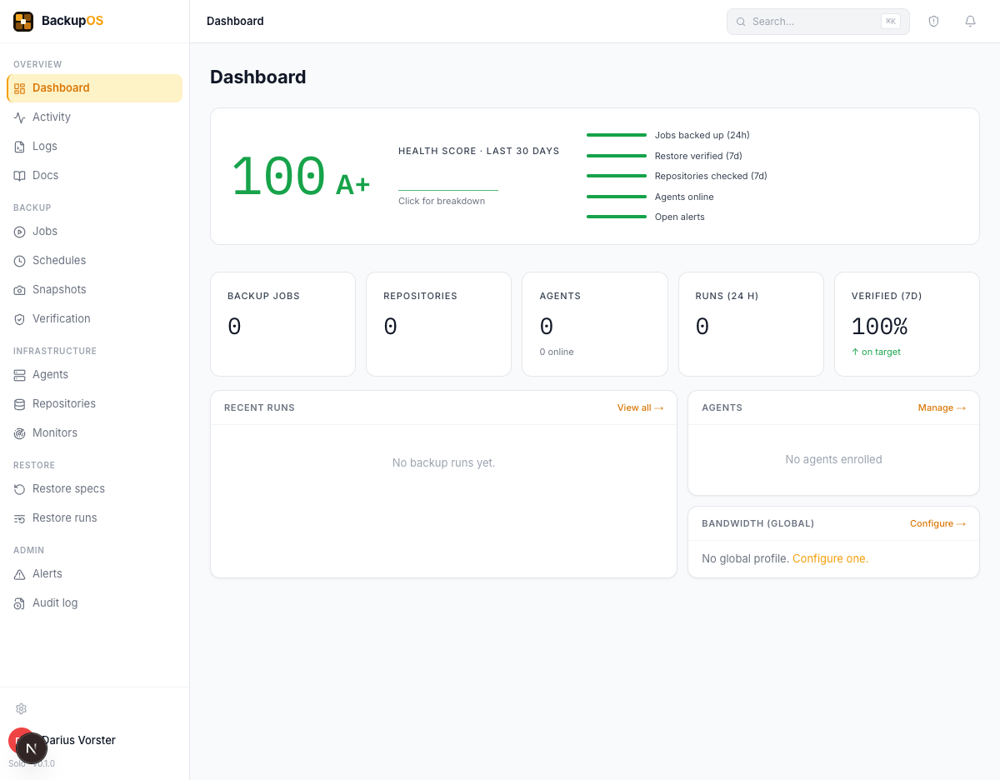

# BackupOS

**One backup platform for your entire homelab.**

BackupOS is a self-hosted backup management platform built on [Restic](https://restic.net). Back up Proxmox VMs and LXCs, Linux hosts, Windows machines, Docker containers, databases, and NAS devices — from one dashboard, to one or more repositories, with YAML-defined restore specs that actually work.



---

## Features

- **Unified dashboard** — all repositories, jobs, agents, and restore specs in one place
- **Restic-native** — content-addressed storage, SHA-256 verified, deduplication, incremental-forever
- **Multi-backend** — S3, Cloudflare R2, Backblaze B2, SFTP, local filesystem, Rclone
- **Lightweight agents** — single binary for Linux and Windows remote hosts, no dependencies
- **Hypervisor integration** — Proxmox VMs and LXCs via API
- **YAML restore specs** — define, version, and test your recovery procedure as code
- **DR Mode** — guided recovery wizard for files, databases, and full hosts
- **Monitors** — track backup health scores, detect missed jobs, alert on failures
- **Alert channels** — Discord, Slack, generic webhooks, email via SMTP
- **Snapshot browser** — browse and compare repository snapshots
- **Retention policies** — per-job or global keep-last/daily/weekly/monthly/yearly with automatic prune
- **Verification** — scheduled integrity checks with `restic check`
- **API tokens** — for CI/CD and scripting
- **Audit log** — full activity history

---

## Quick start (Docker)

**1. Copy the environment file and fill in the required values:**

```bash
cp .env.example .env
```

Edit `.env`:

```env
ENCRYPTION_KEY=        # openssl rand -hex 32
BETTER_AUTH_SECRET=    # openssl rand -hex 32
BETTER_AUTH_URL=http://localhost:3000
```

**2. Start the container:**

```bash
docker compose up -d
```

**3. Open BackupOS:**

```
http://localhost:3000
```

On first load you'll be prompted to create the admin account. After that, signup is disabled — additional users are managed from within the app.

---

## Environment variables

| Variable | Required | Description |
|---|---|---|
| `ENCRYPTION_KEY` | Yes | 32-byte hex key for encrypting stored credentials. Generate: `openssl rand -hex 32` |
| `BETTER_AUTH_SECRET` | Yes | Secret for signing auth sessions. Generate: `openssl rand -hex 32` |
| `BETTER_AUTH_URL` | Yes | Public URL of your BackupOS instance (used for auth callbacks) |
| `DATABASE_URL` | No | SQLite path. Defaults to `file:/app/data/backupos.db` |
| `RESTIC_BINARY_PATH` | No | Path to restic binary. Defaults to `restic` in PATH |
| `RESEND_API_KEY` | No | [Resend](https://resend.com) API key for email alerts |
| `ALERT_TO_EMAIL` | No | Default recipient address for email alerts |

---

## Exposing to the internet

If you want to access BackupOS outside your local network, put it behind a reverse proxy with HTTPS. Example with Caddy:

```
backupos.example.com {
    reverse_proxy localhost:3000
}
```

Update `BETTER_AUTH_URL` to match your public domain:

```env
BETTER_AUTH_URL=https://backupos.example.com
```

---

## Agents

The BackupOS agent is a lightweight binary that runs on remote hosts and executes backup jobs locally, sending results back to your BackupOS instance.

### Install on Linux

```bash
curl -fsSL https://github.com/dariusvorster/backupos/releases/latest/download/backupos-agent-linux-x64 \
  -o /usr/local/bin/backupos-agent \
  && chmod +x /usr/local/bin/backupos-agent

backupos-agent --server http://your-backupos:3000 --token <api-token>
```

### Install on Linux (arm64)

```bash
curl -fsSL https://github.com/dariusvorster/backupos/releases/latest/download/backupos-agent-linux-arm64 \
  -o /usr/local/bin/backupos-agent \
  && chmod +x /usr/local/bin/backupos-agent
```

### Install on macOS

```bash
curl -fsSL https://github.com/dariusvorster/backupos/releases/latest/download/backupos-agent-darwin-arm64 \
  -o /usr/local/bin/backupos-agent \
  && chmod +x /usr/local/bin/backupos-agent
```

### Install on Windows

Download `backupos-agent-windows-x64.exe` from the [latest release](https://github.com/dariusvorster/backupos/releases/latest) and run it:

```powershell
.\backupos-agent-windows-x64.exe --server http://your-backupos:3000 --token <api-token>
```

Generate an API token from **Settings → API tokens** in the BackupOS dashboard.

---

## Verifying downloads

Every release includes a `SHA256SUMS.txt` file. Verify your download:

```bash
sha256sum -c SHA256SUMS.txt --ignore-missing
```

---

## Updating

```bash
docker compose pull && docker compose up -d
```

BackupOS runs database migrations automatically on startup.

---

## Building from source

**Requirements:** Node.js 22+, pnpm 9+

```bash
git clone https://github.com/dariusvorster/backupos
cd backupos
pnpm install
pnpm --filter @backupos/db build
pnpm --filter @backupos/engine build
pnpm --filter @backupos/monitors build
pnpm --filter @backupos/restore build
pnpm --filter @backupos/api build
pnpm --filter @backupos/docs-content build
pnpm --filter @backupos/web exec next build
cp .env.example .env  # fill in required values
pnpm --filter @backupos/web start
```

### Build the Docker image locally

```bash
docker build -t backupos .
```

Multi-arch (requires Docker Buildx):

```bash
docker buildx build --platform linux/amd64,linux/arm64 -t backupos .
```

---

## Data & backups

All BackupOS data lives in a single SQLite database at `/app/data/backupos.db` (mounted as a named volume by default). Back this up regularly — it holds your job configs, agent registrations, restore specs, and alert settings.

```bash
# One-line backup of the BackupOS database itself
docker exec backupos sqlite3 /app/data/backupos.db ".backup '/app/data/backupos.db.bak'"
```

---

## License

MIT
